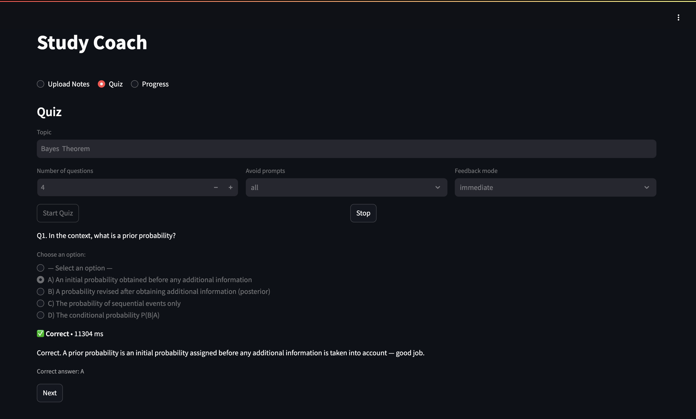

## Study Coach — Streamlit Q&A App

A study coach that ingests your notes (PDF/TXT/MD), generates adaptive quizzes, grades answers with structured feedback, and tracks progress over time. Includes a Streamlit web app and a CLI.



---

### 🔑 Key features
- **Upload Notes tab**: Upload PDFs/TXT/MD. Notes are saved to `data/notes/` and the vector store is rebuilt.
- **Quiz tab**:
  - Topic input, number of questions.
  - Feedback mode: `immediate` (per-question) or `end` (after all).
  - Avoid prompts: avoid repeating questions you’ve seen before (all or only those answered correctly).
  - Adaptive difficulty: easier if <50% accuracy, harder reasoning if ≥80%.
  - Clean inline feedback: “Correct/Incorrect + explanation”. Shows the correct option for MCQs.
- **Progress tab**: Session summary and frequently missed questions per topic (with error rate and avg response time).
- **Persistent memory**: `progress.json` logs sessions and per-question attempts with timing.

## ⚡ Quickstart

### 🛠️ Requirements
- 🐍 Python 3.10+ recommended
- 🔑 An OpenAI API key (stored in a local `.env` file)

Install dependencies (optional but recommended to use a virtualenv):
```bash
python -m venv .venv
source .venv/bin/activate   # Windows: .venv\Scripts\activate
pip install -r requirements.txt
```

Create a `.env` file in the project root (do NOT commit this file):
```env
OPENAI_API_KEY=sk-your-key-here
```

### 🚀 Launch the Streamlit app
```bash
streamlit run app.py
```
- 1️⃣ Tab 1: Upload notes → files go to `data/notes/` and the vector store rebuilds
- 2️⃣ Tab 2: Quiz → choose topic, options, and start
- 3️⃣ Tab 3: Progress → view sessions and frequently missed questions

### 💻 CLI usage (optional)
Run a quiz from the terminal:
```bash
python -m src.main --topic "Bayes theorem" --n 4 --avoid all --feedback immediate
```
Flags (CLI):
- 🎯 `--topic` (required): quiz topic
- 🔢 `--n`: number of questions (default 4)
- 🔄 `--avoid`: `all` to avoid all past prompts, `correct` to avoid only correctly answered ones
- ⚡ `--feedback`: `immediate` or `end`
- 📂 `--docs`: notes folder (default `data/notes`)
- 🛠️ `--rebuild`: rebuild vector store (if needed)

## 🧠 How it works

### 📥 Ingestion and retrieval
- Notes are chunked and embedded using LangChain + OpenAI embeddings.
- A Chroma vector store (`vectorstore/`) is used to retrieve relevant context for the quiz.

### 📝 Quiz generation and grading
- `src/quiz_engine.py` calls the LLM to generate structured JSON (MCQ + short-answer).
- `src/evaluation.py` grades each answer and returns `{correct: bool, feedback: str}`.

### 🧩 Memory and adaptivity
- `src/memory.py` logs:
  - `sessions`: topic, score, timestamp, details
  - `attempts`: each question’s prompt, student answer, correctness, `response_ms`
  - `questions` aggregate: `times_asked`, `last_correct`, `avg_response_ms`, etc.
- Avoid prompts uses history (topic-scoped) to reduce repetition.
- Difficulty adapts by topic accuracy (<50% → easy; 50–79% → medium; ≥80% → hard).

Example `progress.json` (trimmed):
```json
{
  "sessions": [
    {"timestamp": "2025-08-20T12:35:01Z", "topic": "Bayes theorem", "score": 75.0,
     "details": {"raw": "3/4", "avoid_mode": "all", "difficulty": "medium", "feedback_mode": "immediate"}}
  ],
  "attempts": [
    {"timestamp": "2025-08-20T12:34:10Z", "topic": "Bayes theorem",
     "question_id": "a1b2c3d4e5f6a7b8", "prompt": "State Bayes' theorem...",
     "student_answer": "P(A|B)=...", "correct": true, "response_ms": 9342}
  ]
}
```

## 🗂️ Project structure
```text
Q&A_Agent/
  app.py                 # Streamlit app (Upload Notes, Quiz, Progress)
  requirements.txt
  src/
    config.py            # model settings
    ingest.py            # load and chunk documents
    retriever.py         # build/load Chroma, retrieve context
    quiz_engine.py       # generate quiz JSON
    evaluation.py        # grade answers, return {correct, feedback}
    memory.py            # JSON memory: sessions, attempts, aggregates
    main.py              # CLI quiz runner
  data/notes/            # uploaded notes (ignored via .gitignore)
  vectorstore/           # Chroma DB files (ignored via .gitignore)
  progress.json          # progress log (ignored via .gitignore)
```

## 🛠️ Troubleshooting
- ⚠️ Chroma deprecation warnings: we’re using `langchain_chroma`; ensure `langchain-chroma` is installed.
